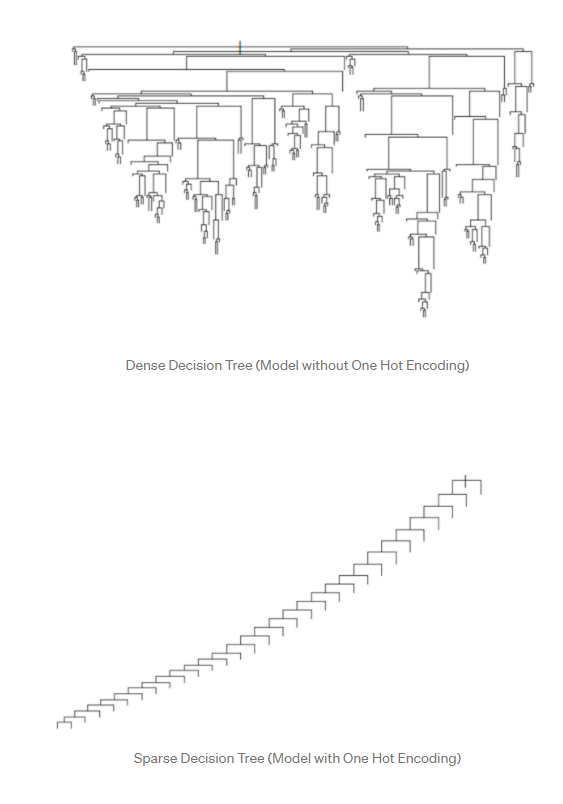

```{r setup, include=FALSE}
knitr::opts_chunk$set(echo = TRUE)
```

## Additional EDA

In the EDA of the [NYPD Historical Complaint Data](https://data.cityofnewyork.us/Public-Safety/NYPD-Complaint-Data-Historic/qgea-i56i),I made the decision to limit my dataset to only records from 2020 and 2021. I have since trimmed this dataset even further, to only data in the second half of 2021. The runtimes for almost everything in the dataset were taking far too long as is. This trims the dataset from 860k rows to a much more processable 244307.

In light of this I have also dropped the RPT_DT- my hope was to use this field to see if cyclical crime was observable in our model, perhaps dividing the date into months. Given that we no longer have a full year’s worth of data, the dataset is complicated enough as is, and many of the ML models have issues with date data.

During EDA we dropped a number of location fields. Of these, latitude and longitude were included, passed up in favor of the precinct code. While I still believe Precinct code would be a better metric, I have reversed this decision to use Lat and Long instead. This is because One-Hot encoding turned address pct code into 71 fields, comprising over 1/3 of the fields in our dataset. This was incredibly burdensome for calculations.

Now I’m going to use this part to vent. If I had known how overly complicated  using large amounts of categorical data would make this project, I would never have picked this data set. My results below will be terrible. I wish I could go back to the drawing board. It’s too late for that. Please tell future students to select numeric data sets because this was a nightmare.

Get ready for paragraphs and paragraphs about how my models tell us nothing about the data, because they don’t. But I can’t turn back at this point and I need to pass this class to graduate this semester. Let’s begin.

## Load the Data
We're going to start by loading the data as processed at the end of EDA. This will be significantly faster than reloading the 2.5GB csv and grooming it every time.

```{r Load Data}
cdata <- read.csv("cdata.csv")
cdata <- subset(cdata, select = -c(X))
length(cdata)
```


### So Wait, What Are We Testing For Again?

I’m so glad you asked. During EDA, we compressed a field, LAW_CAT_CD, which had 3 classes of crime, FELONY, MISDEMEANOR, VIOLATION into a binary categorization called FELONY, 1 if a felony, 0 if not. Essentially, we want to see if we can predict whether a crime will be a felony based on location, premise, and demographic data.

## GLM

Because all the different models have different computational demands, we will use different Test-Train splits for all of our models. For GLM, we will use 70%/30% Train/Test

```{r GLM TT-Split}
set.seed(777)
train_pct = .7
split <- sample(c(TRUE, FALSE), nrow(cdata), replace=TRUE, prob=c(train_pct,(1-train_pct)))

cdTrain <- cdata[split,]
cdTest <- cdata[!split,]
nrow(cdTrain)
nrow(cdTest)
```

We’ll set up our GLM model using the following code (adapted from [here](https://www.digitalocean.com/community/tutorials/plot-roc-curve-r-programming)) to process our training data. First let’s set up our custom error metric function to print all the required metrics. We can use this for all our models!

```{r Error Metrics}
err_metric=function(CM)
{
  TN =CM[1,1]
  TP =CM[2,2]
  FP =CM[1,2]
  FN =CM[2,1]
  precision =(TP)/(TP+FP)
  specificity_score = (TN) / (TN + FP)
  recall_score =(FP)/(FP+TN)
  f1_score=2*((precision*recall_score)/(precision+recall_score))
  accuracy_model  =(TP+TN)/(TP+TN+FP+FN)
  False_positive_rate =(FP)/(FP+TN)
  False_negative_rate =(FN)/(FN+TP)
  print(paste("Accuracy of the model: ",round(accuracy_model,2)))
  print(paste("Specificity value of the model: ",round(specificity_score,2)))
  print(paste("Precision value of the model: ",round(precision,2)))
  print(paste("Recall/Sensitivity value of the model: ",round(recall_score,2)))
}
```

Next let’s build our model, confusion matrix, and get the error stats
```{r GLM}
glm_m =glm(FELONY ~ . ,data =cdTrain ,family='binomial')
# 124 is the index of FELONY column
glm_p = predict(glm_m , newdata = cdTest,type = 'response')
glm_var <- paste("Variance: ", var(glm_p))
glm_p <- ifelse(glm_p > 0.5,1,0) # Probability check
glm_CM= table(cdTest$FELONY , glm_p)
print(glm_CM)
err_metric(CM)
print(glm_var)
```

Our GLM model seems to do a good job categorizing true negatives as negative with a specificity of 96%, clearly reflected in the first row of our confusion matrix. However the Sensitivity of the model is extremely poor at only 7%. Taken together, this says to me that the GLM model is overly aggressive in classifying complaints as non-felonies. If I had time, I would go back and revise the used dataset, but we'll need to proceed with what we've got. The ROC and AUC curves should validate or disprove my assumption.

```{r GLM ROCAUC}
library(pROC)
glm_roc_score=roc(cdTest$FELONY, glm_p) #AUC score
plot(glm_roc_score ,main ="ROC curve -- Logistic Regression")
print(glm_roc_score$auc)
```

Our ROC curve reveals that our model has almost no predictive value, almost a dead fit for the diagonal- verifying my earlier suspicion with a miserable AUC of 46%, actually underperforming a random classifier! Dreadful. On to some other models!

## SVM

SVM is an incredibly compute-demanding model. Instead of running it on the same training set we used in GLM, we will run it on a much smaller subset of 5% of the data.

```{r SVM TestTrain}
set.seed(777)
train_pct = .05
split <- sample(c(TRUE, FALSE), nrow(cdata), replace=TRUE, prob=c(train_pct,(1-train_pct)))

cdTrain <- cdata[split,]
cdTest <- cdata[!split,]
nrow(cdTrain)
nrow(cdTest)
```

We'll be able to reuse our `err_metric()` function from GLM here, as the data is processed the exact same way. 
```{r SVM}
library(e1071)
svm_m = suppressWarnings(svm(FELONY ~ . ,data =cdTrain ,probability=TRUE, kernel = "linear"))
svm_p = predict(svm_m , newdata = cdTest,type = 'response')
svm_var <- paste("Variance: ", var(svm_p))
svm_p <- ifelse(svm_p > 0.5,1,0) # Probability check
svm_CM= table(cdTest$FELONY , svm_p)
print(svm_CM)
err_metric(svm_CM)
print(svm_var)
```
We see here an extremely similar result to our GLM model. Our accuracy, specificity, and precision are a little better in spite of us using a much smaller sample of the data! But our recall again is nearly useless. We categorize negatives just fine but almost can't identify positives at all.

```{r SVM ROCAUC}
library(pROC)
svm_roc_score=roc(cdTest$FELONY, svm_p) #AUC score
plot(svm_roc_score ,main ="ROC curve -- Support Vector Machine")
print(svm_roc_score$auc)
```
Almost diagonal. Another useless model. Maybe KNN will be more useful!

## Decision Tree
Our dataset is not optimally set up for Decision Tree. Because our factors are already one-hot encoded, resulting in a dataset that is 129 boolean fields and 2 numerical fields. This is going to result in an extremely sparse Decision Tree. This means the model will perform quite slowly, because there will be a tremendous number of decision points.



```{r DT Split}
set.seed(777)
train_pct = .7
split <- sample(c(TRUE, FALSE), nrow(cdata), replace=TRUE, prob=c(train_pct,(1-train_pct)))

cdTrain <- cdata[split,]
cdTest <- cdata[!split,]
nrow(cdTrain)
nrow(cdTest)
```

```{r DT}
library(rpart)

rpart_m = rpart(FELONY ~ . ,data = cdTrain)
# 26 is the index of FELONY column
rpart_p = predict(rpart_m , newdata = cdTest)
rpart_var <- paste("Variance: ", var(rpart_p))
rpart_p <- ifelse(rpart_p > 0.5,1,0) # Probability check
dt_CM= table(cdTest$FELONY , rpart_p)
print(dt_CM)
err_metric(dt_CM)
print(rpart_var)
```

```{r DT Plot}
library(rattle)
library(rpart.plot)
library(RColorBrewer)
fancyRpartPlot(rpart_m)
```

```{r DT ROCAUC}
library(pROC)
dt_roc_score=roc(cdTest$FELONY, rpart_p) #AUC score
plot(dt_roc_score ,main ="ROC curve -- Decision Tree")
print(dt_roc_score$auc)
```


## KNN

Again, given the demands of KNN, we will use a 5%/95% Train/Test Split

```{r KNN Split}
set.seed(777)
train_pct = .05
split <- sample(c(TRUE, FALSE), nrow(cdata), replace=TRUE, prob=c(train_pct,(1-train_pct)))

cdTrain <- cdata[split,]
cdTest <- cdata[!split,]
nrow(cdTrain)
nrow(cdTest)
```

```{r KNN}
library(caret)
knn_grid <- expand.grid(k = 4)
knn_m <- suppressWarnings(train(FELONY ~., data = cdTrain, method = "knn",
                 preProcess = c("center", "scale"), tuneGrid = knn_grid, distance = "euclidean"))
knn_p <- predict(knn_m, newdata = cdTest)
knn_var <- paste("Variance: ", var(knn_p))
knn_p <- ifelse(knn_p > 0.5,1,0) # Probability check
knn_CM= table(cdTest$FELONY , knn_p)
print(knn_CM)
err_metric(knn_CM)
```


```{r KNN}
library(caret)
trctrl <- trainControl(method = "cv", number = 10)
knn_fit <- train(FELONY ~., data = cdTrain, method = "knn",
                 trControl=trctrl,
                 preProcess = c("center", "scale"),
                 tuneLength = 10)
knn_p <- predict(knn_fit, newdata = cdTest)
knn_var <- paste("Variance: ", var(knn_p))
knn_p <- ifelse(knn_p > 0.5,1,0) # Probability check
knn_CM= table(cdTest$FELONY , knn_p)
print(knn_CM)
err_metric(knn_CM)
```


```{r KNN ROCAUC}
library(pROC)
knn_roc_score=roc(cdTest$FELONY, knn_p) #AUC score
plot(knn_roc_score ,main ="ROC curve -- K Nearest Neighbor ")
print(knn_roc_score$auc)
```
